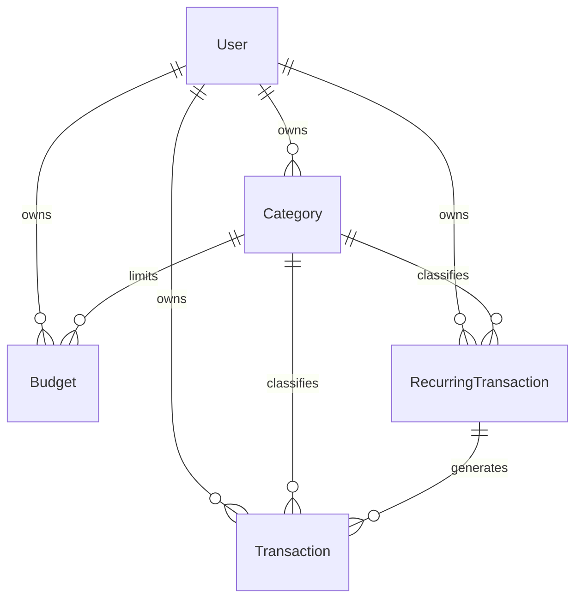

# Finance Manager

A personal finance manager for tracking income and expenses in Indonesian Rupiah: monthly budgets, recurring bills, analytics, and CSV import and export. Built as a portfolio project with Next.js (App Router), Prisma and PostgreSQL, and deployed on Vercel with Neon.

**Live demo:** _add your Vercel URL here_. Click **Try Demo** to explore a pre-filled account, no sign-up needed. Demo data resets every day.


<!-- Screenshots: save PNGs in docs/screenshots/ with these names. -->

| Transactions | Analytics |
| --- | --- |
|  |  |
| **Budgets** | **Mobile (dark mode)** |
|  |  |

## Features

- **Dashboard**: current balance and this month's income and expenses with change vs last month, a 6-month spending chart, recent transactions, and the budgets closest to their limit.
- **Transactions**: add, edit and delete from anywhere; live search (debounced); filters for date range presets, type, categories and amount; sorting; pagination; totals for the current filter. All filter state lives in the URL, so views survive refresh and can be shared.
- **Analytics**: spending by category (click a slice to open the matching transactions), spending trend, income vs expense with net savings, budget vs actual, and insights such as savings rate and average daily spending. Legends toggle series, and every chart has a table view.
- **Budgets**: monthly limits per expense category, progress bars that warn at 80% and 100%, and copying last month's budgets.
- **Recurring transactions**: daily, weekly, monthly or yearly items that generate transactions automatically, with pause and resume. Month-end dates are handled (31st becomes Feb 28/29).
- **Categories**: custom income and expense categories with colors and icons. Deleting a category that is in use moves its transactions first.
- **CSV import and export**: a 4-step import with column mapping, per-row validation, duplicate warnings and automatic category creation, run in a single database transaction. Export respects the current filters.
- **Auth**: email and password sign-up and login, plus one-click **Try Demo**.
- **Everywhere**: dark mode (light, dark or system, without a flash on load), mobile-first layouts, loading skeletons, empty states and toasts.

## Tech stack

| Area | Choice |
| --- | --- |
| Framework | Next.js 16 (App Router, Server Components, Server Actions), React 19 |
| Language | TypeScript (strict) |
| Database | PostgreSQL on Neon |
| ORM | Prisma 7 with the Neon driver adapter |
| Auth | Auth.js v5 (credentials provider, JWT sessions) |
| UI | Tailwind CSS 4, lucide icons, Sonner toasts |
| Charts | Recharts |
| Validation | Zod (every Server Action validates its input on the server) |
| Hosting | Vercel, with Vercel Cron for daily jobs |

### Engineering notes

- Money is stored as integer Rupiah (`Int`), never floats, and formatted as `Rp 1.250.000`.
- Every query is scoped to the signed-in user's id.
- Reports aggregate in the database (`GROUP BY` / Prisma `groupBy`) instead of loading transactions into memory.
- Recurring generation is idempotent even when two runs overlap. Each item is claimed with a compare-and-swap on `lastGeneratedDate` inside the same transaction as the inserts.
- CSV export streams rows in batches and guards against spreadsheet formula injection.
- Chart colors were checked for color-blind safety and contrast in both themes.

## Database schema



| Model | Key fields | Notes |
| --- | --- | --- |
| `User` | `email` (unique), `passwordHash` | bcrypt hash |
| `Category` | `name`, `type` (INCOME / EXPENSE), `color`, `icon` | unique on `userId + name + type` |
| `Transaction` | `type`, `amount` (Int), `date` (date only), `note?`, `recurringId?` | indexed on `userId + date` |
| `Budget` | `month` ("YYYY-MM"), `amount` (Int) | unique on `userId + categoryId + month` |
| `RecurringTransaction` | `frequency`, `startDate`, `endDate?`, `lastGeneratedDate?`, `isActive` | generated transactions keep a link back |

Deleting a user deletes all of their data. A category that still has transactions or recurring items can't be deleted directly; the app moves them to another category first. Deleting a recurring item keeps the transactions it created.

## Local setup

**Prerequisites:** Node.js 20.9 or newer (22 recommended) and a PostgreSQL database. A free [Neon](https://neon.tech) project works well; a local Postgres works too.

```bash
git clone https://github.com/frgwnabim/finance_management_app.git
cd finance_management_app
npm install                 # also runs `prisma generate`

cp .env.example .env        # then fill in the values (see below)

npm run db:deploy           # apply migrations
npm run db:seed             # optional: create the demo account with 6 months of data
npm run dev                 # http://localhost:3000
```

Use `.env` rather than `.env.local`: the Prisma CLI only reads `.env`.

> **Local Postgres:** `lib/prisma.ts` uses Prisma's Neon adapter, which connects over WebSockets and needs a Neon database. To use a plain local Postgres instead, install `@prisma/adapter-pg` and swap the adapter in `lib/prisma.ts`.

### Scripts

| Command | What it does |
| --- | --- |
| `npm run dev` | Start the dev server |
| `npm run build` / `npm start` | Production build and server |
| `npm run typecheck` | Generate route types and run `tsc` |
| `npm run lint` | ESLint |
| `npm run db:migrate` | Create and apply a migration in development (`prisma migrate dev`) |
| `npm run db:deploy` | Apply pending migrations (`prisma migrate deploy`) |
| `npm run db:seed` | Reset and seed the demo account |
| `npm run db:studio` | Open Prisma Studio |

### Environment variables

| Variable | Used by | Description |
| --- | --- | --- |
| `DATABASE_URL` | App at runtime | Neon **pooled** connection string (host contains `-pooler`) |
| `DIRECT_URL` | Prisma CLI | Neon **direct** connection string, for migrations and seeding. Optional: falls back to `DATABASE_URL_UNPOOLED` (set by the Vercel Neon integration), then `DATABASE_URL` |
| `AUTH_SECRET` | Auth.js | Secret for signing sessions. Generate with `npx auth secret`. Optional: derived from the database URL when missing |
| `CRON_SECRET` | Cron routes | Bearer token Vercel Cron sends to `/api/cron/*`. Generate with `openssl rand -hex 32`. Optional: cron jobs are rejected without it |
| `AUTH_TRUST_HOST` | Auth.js (optional) | Set to `true` when running `npm start` outside Vercel (e.g. locally or self-hosted). Not needed on Vercel or in `npm run dev` |

## Deploying to Vercel with Neon

No environment variables need to be filled in by hand.

1. **Import the repository** in Vercel (**Add New → Project**) and click **Deploy**. Keep all build settings at their defaults. The first deploy succeeds without a database, and the site shows a "connect a database" notice.
2. **Create the database.** In the Vercel project, open **Storage → Create Database → Neon**. Connect it to the project for all environments and keep the default settings. Vercel adds the connection variables (`DATABASE_URL`, `DATABASE_URL_UNPOOLED`) automatically.
3. **Redeploy.** In **Deployments**, redeploy the latest deployment. The build runs `prisma migrate deploy` and creates all tables. After that the app is live: **Try Demo** creates the demo account on first use, and anyone can sign up.

Every later push to the production branch redeploys and applies new migrations automatically.

### How the zero-config setup works

- `lib/env.ts` reads the database URLs from our own names (`DATABASE_URL`, `DIRECT_URL`) or from the names the Neon integration sets (`DATABASE_URL_UNPOOLED`, or the older `POSTGRES_URL` / `POSTGRES_URL_NON_POOLING`).
- The `vercel-build` script (`scripts/migrate-if-configured.ts`) applies migrations when a database is connected and skips them otherwise, so the first deploy never fails.
- If `AUTH_SECRET` isn't set, the session secret is derived from the database URL. Setting your own `AUTH_SECRET` is still recommended: it lets you rotate the secret on its own, and changing the database password otherwise signs everyone out.

### Optional settings

| Variable | Why you might set it |
| --- | --- |
| `AUTH_SECRET` | Your own session secret (recommended). Generate with `npx auth secret`. |
| `CRON_SECRET` | Turns on the two daily cron jobs in `vercel.json`. Generate with `openssl rand -hex 32`. |

About the cron jobs:

- `/api/cron/reset-demo` runs at 17:00 UTC (00:00 WIB) and restores the demo data.
- `/api/cron/recurring` runs at 17:05 UTC (00:05 WIB) and generates due recurring transactions for all users.
- Both reject requests without `Authorization: Bearer $CRON_SECRET`.
- Without `CRON_SECRET`, the app still works: recurring transactions are generated whenever a user opens the app, and demo visitors can use **Reset demo data**.
- After adding or changing any variable, redeploy.

### Tips

- In **Settings → Functions**, set the region to match your Neon database (for example Singapore, `sin1`) to keep queries fast.
- **Preview deployments** also run migrations. The Neon integration gives each preview its own database branch, so your production data is safe.
- **Seeding manually** is optional, because Try Demo creates the demo account. To run it yourself: `DATABASE_URL="<pooled url>" DIRECT_URL="<direct url>" npm run db:seed`.

## Project structure

```
app/            Routes: landing (/), auth, the app under /app, API routes (auth, cron, CSV export)
components/     UI primitives in components/ui, feature components by area
lib/            Data access (lib/data), Server Actions (lib/actions), validation, date and money helpers
prisma/         Schema, migrations and the demo seed
```
